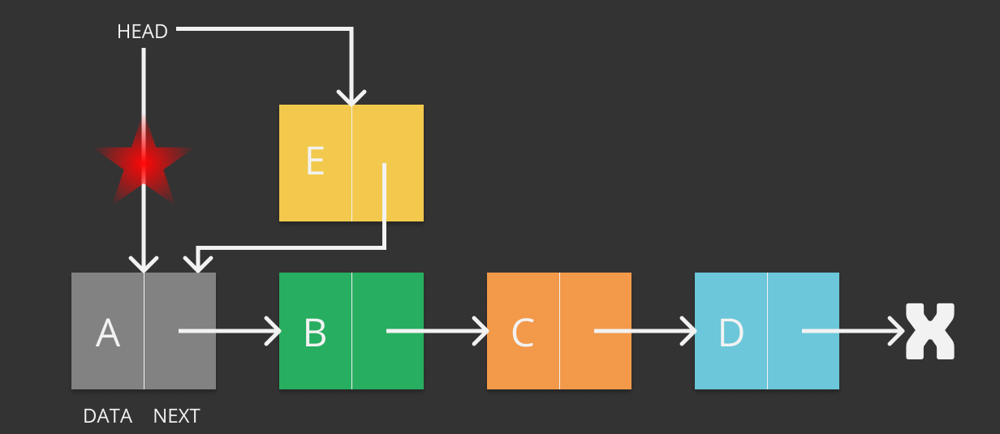
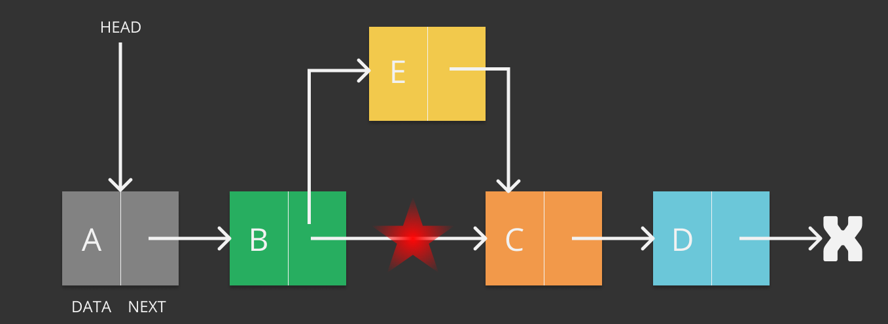
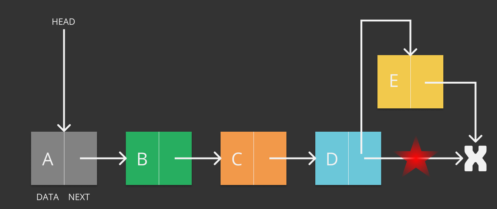
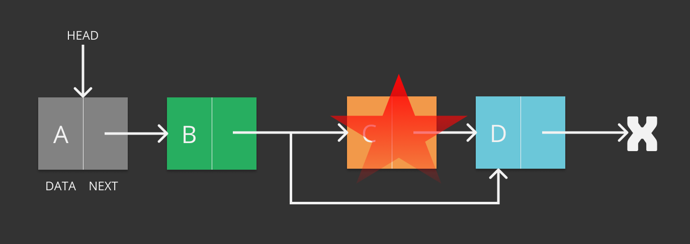
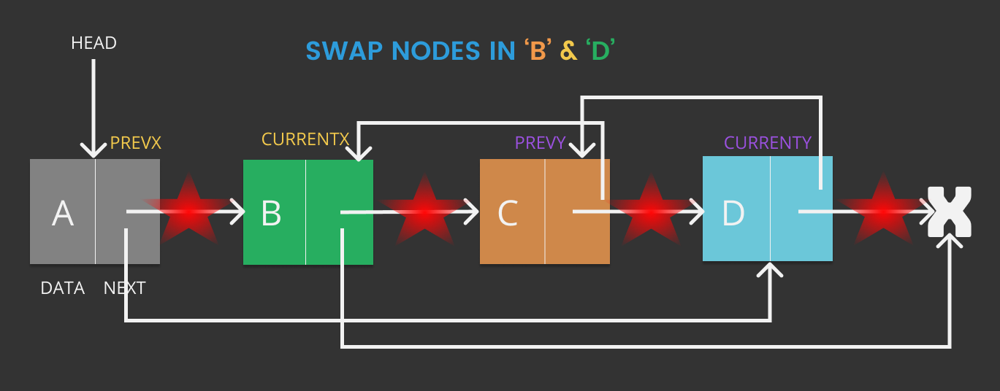

# Data Structures in C++

Same Old Shite :joy: written, compiled & coded by [A2K](https://github.com/deadcoder0904)

## Linked List

### Structure

```cpp

typedef char dataType;

typedef struct node {
	dataType data;
	struct node *next;
} node;

```

### Printing

```cpp

void printList(node *node) {
	while(node != NULL) {
		cout<<(node->data)<<" -> ";
		node = node->next;
	}
	cout<<"NULL";
}

```

### Insertion

Insertion in a linked list can be done in 3 ways - 

#### 1. Insert at Start



```cpp

void insertAtStart(node **head, dataType data) {
	node* new_node = (node*) malloc(sizeof(node));
	
	new_node->data = data;
	new_node->next = *head;
	
	*head = new_node;
}

```

#### 2. Insert after a Node



```cpp

void insertAfter(node *prev_node, dataType data) {
	if(prev_node == NULL) {
		cout<<"Previous Node cannot be NULL"<<endl;
		return;
	}

	node* new_node = (node*) malloc(sizeof(node));
	
	new_node->data = data;
	new_node->next = prev_node->next;

	prev_node->next = new_node;
}

```

#### 3. Insert in the end



```cpp

void insertAtEnd(node **head, dataType data) {
	node* new_node = (node*) malloc(sizeof(node));
	
	new_node->data = data;
	new_node->next = NULL;

	if(*head == NULL) {
		*head = new_node;
		return;
	}

	node *last = *head;

	while(last -> next != NULL)
		last = last->next;
	
	last->next = new_node;
}

```

#### Example

```cpp

node *head = NULL;
insertAtEnd(&head, 'B');
insertAtFirst(&head, 'A');
insertAfter(head->next, 'C');
insertAtEnd(&head, 'D');
insertAtEnd(&head, 'E');
printList(head);

```

#### Output

<p class="tip">A -> B -> C -> D -> E -> NULL</p>

#### [Complete Program](https://github.com/deadcoder0904/datastructures-practice/blob/master/linked-list/insert.cpp)

### Deletion

#### 1. Deleting a given key



```cpp

void deleteNodeWithSpecifiedKey(node **head, dataType key) {
	node *temp = *head, *prev;
	if(temp != NULL && temp->data == key) {
		*head = temp->next;
		free(temp);
		return;
	}

	while(temp != NULL && temp->data != key) {
		prev = temp;
		temp = temp->next;
	}

	if(temp == NULL) {
		cout<<"Key "<<key<<" not found"<<endl;
		return;
	}
	
	prev->next = temp->next;
	free(temp);
}

```

#### 2. Deleting a key at given position


```cpp

void deleteNodeWithSpecifiedPostion(node **head,int position) {
	node *temp = *head;
	
	if(temp == NULL) 
		return;

	if(position == 0) {
		*head = temp->next;
		free(temp);
		return;
	}

	for(int i = 0; temp != NULL && i < position-1; i++) 
		temp = temp->next;
	
	if(temp == NULL || temp->next == NULL)
		return;

	node *next = temp->next->next;
	
	free(temp->next);
	temp->next = next;
}

```

#### Example

```cpp

node *head = NULL;
insertAtStart(&head, 'D');
insertAtStart(&head, 'C');
insertAtStart(&head, 'B');
insertAtStart(&head, 'A');
cout<<"Deleting node with key 'C' : "<<endl;
deleteNodeWithSpecifiedKey(&head, 'C');
printList(head);
cout<<"Deleting node at position 1 : "<<endl;
deleteNodeWithSpecifiedPostion(&head,1);
printList(head);

```

#### Output

```cpp
Deleting node with key 'C' : 
A -> B -> D -> NULL
Deleting node at position 1 : 
A -> D -> NULL

```

#### [Complete Program](https://github.com/deadcoder0904/datastructures-practice/blob/master/linked-list/delete-a-node.cpp)

### Length

#### 1. Iterative

```cpp

int iterativeLength(node *head) {
	int length = 0;
	node *temp = head;
	while(temp != NULL) {
		temp = temp->next;
		length++;
	}
	return length;
}

```

#### 2. Recursive

```cpp

int recursiveLength(node *head) {
	if(head == NULL)
		return 0;
	return recursiveLength(head->next) + 1;	
}

```

#### Example

```cpp

node *head = NULL;
insertAtStart(&head, 'E');
insertAtStart(&head, 'D');
insertAtStart(&head, 'C');
insertAtStart(&head, 'B');
insertAtStart(&head, 'A');
cout<<"Length of Linked List using Iterative Method : "<<iterativeLength(head)<<endl;
cout<<"Length of Linked List using Recursive Method : "<<recursiveLength(head)<<endl;

```

#### Output

```cpp
Length of Linked List using Iterative Method : 5
Length of Linked List using Recursive Method : 5

```

#### [Complete Program](https://github.com/deadcoder0904/datastructures-practice/blob/master/linked-list/length-of-linked-list.cpp)

### Search

#### 1. Iterative

```cpp

int iterativeSearch(node *head, dataType key) {
	node *temp = head;
	while(temp != NULL) {
		if(temp->data == key)
			return true;
		temp = temp->next;
	}
	return false;
}

```

#### 2. Recursive

```cpp

int recursiveSearch(node *head, dataType key) {
	if(head == NULL)
		return false;
	if(head->data == key)
		return true;
	return recursiveSearch(head->next,key);
}

```

#### Example

```cpp

node *head = NULL;
insertAtStart(&head, 'E');
insertAtStart(&head, 'D');
insertAtStart(&head, 'C');
insertAtStart(&head, 'B');
insertAtStart(&head, 'A');
cout<<"Search key in a Linked List using Iterative Method : "<<iterativeSearch(head,'C')<<endl;
cout<<"Search key in a Linked List using Recursive Method : "<<recursiveSearch(head,'Z')<<endl;

```

#### Output

```cpp
Search key in a Linked List using Iterative Method : 1
Search key in a Linked List using Recursive Method : 0

```

#### [Complete Program](https://github.com/deadcoder0904/datastructures-practice/blob/master/linked-list/search-in-linked-list.cpp)

### Swap Nodes



```cpp

void swapNodes(node **head, dataType x, dataType y) {
	if(x == y) return;

	node *prevX = NULL, *currentX = *head;
	while(currentX != NULL && currentX->data != x) {
		prevX = currentX;
		currentX = currentX->next;
	}

	node *prevY = NULL, *currentY = *head;
	while(currentY != NULL && currentY->data != y) {
		prevY = currentY;
		currentY = currentY->next;
	}
	
	if(currentX == NULL || currentY == NULL) 
		return;

	if(prevX != NULL)
		prevX->next = currentY;
	else *head = currentY;

	if(prevY != NULL)
		prevY->next = currentX;
	else *head = currentX;

	node *temp = currentY->next;
	currentY->next = currentX->next;
	currentX->next = temp;
}

```

#### Example

```cpp

node *head = NULL;
insertAtStart(&head, 'E');
insertAtStart(&head, 'D');
insertAtStart(&head, 'C');
insertAtStart(&head, 'B');
insertAtStart(&head, 'A');
cout<<"Before Swapping Nodes : "<<endl;
printList(head);
swapNodes(&head,'B','D');
cout<<"After Swapping Nodes : "<<endl;
printList(head);

```

#### Output

```cpp
Before Swapping Nodes : 
A -> B -> C -> D -> E -> NULL
After Swapping Nodes : 
A -> D -> C -> B -> E -> NULL

```

#### [Complete Program](https://github.com/deadcoder0904/datastructures-practice/blob/master/linked-list/swap-nodes-in-linked-list.cpp)

### Get Nth Node

```cpp
dataType getNthNode(node *head, int n) {
	node *temp = head;
	int count = 0;

	while(temp != NULL) {
		if(count == n)
			return temp->data;
		count++;
		temp = temp->next;
	}

	return '0';
}
```

#### Example

```cpp

node *head = NULL;
insertAtStart(&head, 'E');
insertAtStart(&head, 'D');
insertAtStart(&head, 'C');
insertAtStart(&head, 'B');
insertAtStart(&head, 'A');
printList(head);
cout<<"Get 2nd Node : "<<getNthNode(head,1)<<endl;

```

#### Output

```cpp
A -> B -> C -> D -> E -> NULL
Get 2nd Node : B

```

#### [Complete Program](https://github.com/deadcoder0904/datastructures-practice/blob/master/linked-list/get-nth-node.cpp)

### Get Middle Node

#### 1. Method One

```cpp
dataType getMiddleNode1(node *head) {
	node *temp = head;
	int count = 0;

	while(temp != NULL) {
		count++;
		temp = temp->next;
	}

	int middle = count / 2 + 1;
	temp = head;
	count = 0;

	while(count != middle-1) {
		count++;
		temp = temp->next;
	}
	if(temp == NULL)
        return '0';
	return temp->data;
}
```

#### 2. Method Two

```cpp
dataType getMiddleNode2(node *head) {
	if(head == NULL)
		return '0';

	node *slow_ptr = head, *fast_ptr = head;

	while(fast_ptr != NULL && fast_ptr->next != NULL ) {
		slow_ptr = slow_ptr->next;
		fast_ptr = fast_ptr->next->next;
	}

	return slow_ptr->data;
}
```

#### 3. Method Three

```cpp
dataType getMiddleNode3(node *head) {
	node *mid = head;
	int count = 0;

	while(head != NULL) {
		if(count & 1)
			mid = mid->next;
		count++;
		head = head->next;
	}
	if(mid == NULL)
		return '0';
	return mid->data;
}
```

#### Example

```cpp
node *head = NULL;
insertAtStart(&head, 'E');
insertAtStart(&head, 'D');
insertAtStart(&head, 'C');
insertAtStart(&head, 'B');
insertAtStart(&head, 'A');
printList(head);
cout<<"Get Middle Node 1 : "<<getMiddleNode1(head)<<endl;
cout<<"Get Middle Node 2 : "<<getMiddleNode2(head)<<endl;
cout<<"Get Middle Node 3 : "<<getMiddleNode3(head)<<endl;

```

#### Output

```cpp
A -> B -> C -> D -> E -> NULL
Get Middle Node 1 : C
Get Middle Node 2 : C
Get Middle Node 3 : C
```

#### [Complete Program](https://github.com/deadcoder0904/datastructures-practice/blob/master/linked-list/print-middle-of-linked-list.cpp)

### Get Nth Node from End

```cpp
dataType getNthNodeFromLast(node *head, int n) {
	node *temp = head;
	int count = 0;

	while(temp != NULL) {
		count++;
		temp = temp->next;
	}

	int position = count - n;
	count = 0;
	temp = head;

	while(count != position) {
		count++;
		temp = temp->next;
	}

	if(temp == NULL)
		return '0';
	return temp->data;
}
```

#### Example

```cpp

node *head = NULL;
insertAtStart(&head, 'E');
insertAtStart(&head, 'D');
insertAtStart(&head, 'C');
insertAtStart(&head, 'B');
insertAtStart(&head, 'A');
printList(head);
cout<<"Get 2nd Node From Last : "<<getNthNodeFromLast(head,1)<<endl;

```

#### Output

```cpp
A -> B -> C -> D -> E -> NULL
Get 2nd Node From Last : D

```

#### [Complete Program](https://github.com/deadcoder0904/datastructures-practice/blob/master/linked-list/get-nth-node-from-last.cpp)
