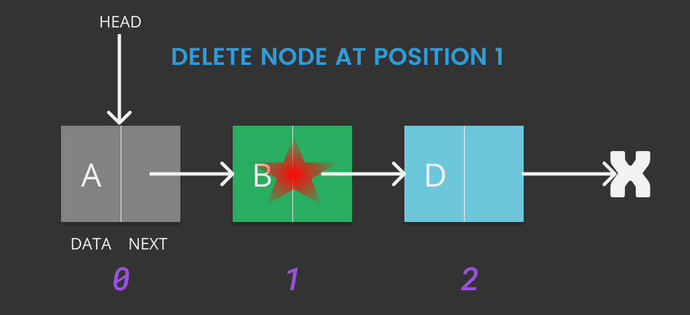

# Data Structures in C++

Same Old Shite :joy: written, compiled & coded by [A2K](https://github.com/deadcoder0904)

## Linked List

Like arrays, Linked List is a linear data structure. Unlike arrays, linked list elements are not stored at contiguous location; the elements are linked using pointers.

## Singly Linked List

It points in only one direction


### 1. Structure

```cpp

typedef char dataType;

typedef struct node {
	dataType data;
	struct node *next;
} node;

```

### 2. Print

```cpp

void printList(node *node) {
	
	if(node == NULL) {
		cout<<"The linked list is empty"<<endl;
		return;
	}

	while(node != NULL) {
		cout<<(node->data)<<" -> ";
		node = node->next;
	}
	cout<<"NULL";
}

```

### 3. Insertion

Insertion in a linked list can be done in 3 ways - 

#### A. Insert at Start


```cpp

void insertAtStart(node **head, dataType data) {
	node* new_node = (node*) malloc(sizeof(node));
	
	new_node->data = data;
	new_node->next = *head;
	
	*head = new_node;
}

```

#### B. Insert after a Node


```cpp

void insertAfter(node *prev_node, dataType data) {
	if(prev_node == NULL) {
		cout<<"Previous Node cannot be NULL"<<endl;
		return;
	}

	node* new_node = (node*) malloc(sizeof(node));
	
	new_node->data = data;
	new_node->next = prev_node->next;

	prev_node->next = new_node;
}

```

#### C. Insert in the end


```cpp

void insertAtEnd(node **head, dataType data) {
	node* new_node = (node*) malloc(sizeof(node));
	
	new_node->data = data;
	new_node->next = NULL;

	if(*head == NULL) {
		*head = new_node;
		return;
	}

	node *last = *head;

	while(last -> next != NULL)
		last = last->next;
	
	last->next = new_node;
}

```

#### Example

```cpp

node *head = NULL;
insertAtEnd(&head, 'B');
insertAtFirst(&head, 'A');
insertAfter(head->next, 'C');
insertAtEnd(&head, 'D');
insertAtEnd(&head, 'E');
printList(head);

```

#### Output

<p class="tip">A -> B -> C -> D -> E -> NULL</p>

#### [Complete Program](https://github.com/deadcoder0904/datastructures-practice/blob/master/linked-list/insert-a-node.cpp)

### 4. Deletion

#### A. Deleting a given key


```cpp

void deleteNodeWithSpecifiedKey(node **head, dataType key) {
	node *temp = *head, *prev;
	if(temp != NULL && temp->data == key) {
		*head = temp->next;
		free(temp);
		return;
	}

	while(temp != NULL && temp->data != key) {
		prev = temp;
		temp = temp->next;
	}

	if(temp == NULL) {
		cout<<"Key "<<key<<" not found"<<endl;
		return;
	}
	
	prev->next = temp->next;
	free(temp);
}

```

#### B. Deleting a key at given position



```cpp

void deleteNodeWithSpecifiedPostion(node **head,int position) {
	node *temp = *head;
	
	if(temp == NULL) 
		return;

	if(position == 0) {
		*head = temp->next;
		free(temp);
		return;
	}

	for(int i = 0; temp != NULL && i < position-1; i++) 
		temp = temp->next;
	
	if(temp == NULL || temp->next == NULL)
		return;

	node *next = temp->next->next;
	
	free(temp->next);
	temp->next = next;
}

```

#### Example

```cpp

node *head = NULL;
insertAtStart(&head, 'D');
insertAtStart(&head, 'C');
insertAtStart(&head, 'B');
insertAtStart(&head, 'A');
cout<<"Deleting node with key 'C' : "<<endl;
deleteNodeWithSpecifiedKey(&head, 'C');
printList(head);
cout<<"Deleting node at position 1 : "<<endl;
deleteNodeWithSpecifiedPostion(&head,1);
printList(head);

```

#### Output

```cpp
Deleting node with key 'C' : 
A -> B -> D -> NULL
Deleting node at position 1 : 
A -> D -> NULL

```

#### [Complete Program](https://github.com/deadcoder0904/datastructures-practice/blob/master/linked-list/delete-a-node.cpp)

### 5. Length

#### A. Iterative

```cpp

int iterativeLength(node *head) {
	int length = 0;
	node *temp = head;
	while(temp != NULL) {
		temp = temp->next;
		length++;
	}
	return length;
}

```

#### B. Recursive

```cpp

int recursiveLength(node *head) {
	if(head == NULL)
		return 0;
	return recursiveLength(head->next) + 1;	
}

```

#### Example

```cpp

node *head = NULL;
insertAtStart(&head, 'E');
insertAtStart(&head, 'D');
insertAtStart(&head, 'C');
insertAtStart(&head, 'B');
insertAtStart(&head, 'A');
cout<<"Length of Linked List using Iterative Method : "<<iterativeLength(head)<<endl;
cout<<"Length of Linked List using Recursive Method : "<<recursiveLength(head)<<endl;

```

#### Output

```cpp
Length of Linked List using Iterative Method : 5
Length of Linked List using Recursive Method : 5

```

#### [Complete Program](https://github.com/deadcoder0904/datastructures-practice/blob/master/linked-list/length-of-linked-list.cpp)

### 6. Search

#### A. Iterative

```cpp

int iterativeSearch(node *head, dataType key) {
	node *temp = head;
	while(temp != NULL) {
		if(temp->data == key)
			return true;
		temp = temp->next;
	}
	return false;
}

```

#### B. Recursive

```cpp

int recursiveSearch(node *head, dataType key) {
	if(head == NULL)
		return false;
	if(head->data == key)
		return true;
	return recursiveSearch(head->next,key);
}

```

#### Example

```cpp

node *head = NULL;
insertAtStart(&head, 'E');
insertAtStart(&head, 'D');
insertAtStart(&head, 'C');
insertAtStart(&head, 'B');
insertAtStart(&head, 'A');
cout<<"Search key in a Linked List using Iterative Method : "<<iterativeSearch(head,'C')<<endl;
cout<<"Search key in a Linked List using Recursive Method : "<<recursiveSearch(head,'Z')<<endl;

```

#### Output

```cpp
Search key in a Linked List using Iterative Method : 1
Search key in a Linked List using Recursive Method : 0

```

#### [Complete Program](https://github.com/deadcoder0904/datastructures-practice/blob/master/linked-list/search-in-linked-list.cpp)

### 7. Swap Nodes


```cpp

void swapNodes(node **head, dataType x, dataType y) {
	if(x == y) return;

	node *prevX = NULL, *currentX = *head;
	while(currentX != NULL && currentX->data != x) {
		prevX = currentX;
		currentX = currentX->next;
	}

	node *prevY = NULL, *currentY = *head;
	while(currentY != NULL && currentY->data != y) {
		prevY = currentY;
		currentY = currentY->next;
	}
	
	if(currentX == NULL || currentY == NULL) 
		return;

	if(prevX != NULL)
		prevX->next = currentY;
	else *head = currentY;

	if(prevY != NULL)
		prevY->next = currentX;
	else *head = currentX;

	node *temp = currentY->next;
	currentY->next = currentX->next;
	currentX->next = temp;
}

```

#### Example

```cpp

node *head = NULL;
insertAtStart(&head, 'E');
insertAtStart(&head, 'D');
insertAtStart(&head, 'C');
insertAtStart(&head, 'B');
insertAtStart(&head, 'A');
cout<<"Before Swapping Nodes : "<<endl;
printList(head);
swapNodes(&head,'B','D');
cout<<"After Swapping Nodes : "<<endl;
printList(head);

```

#### Output

```cpp
Before Swapping Nodes : 
A -> B -> C -> D -> E -> NULL
After Swapping Nodes : 
A -> D -> C -> B -> E -> NULL

```

#### [Complete Program](https://github.com/deadcoder0904/datastructures-practice/blob/master/linked-list/swap-nodes-in-linked-list.cpp)

### 8. Get Nth Node

```cpp
dataType getNthNode(node *head, int n) {
	node *temp = head;
	int count = 0;

	while(temp != NULL) {
		if(count == n)
			return temp->data;
		count++;
		temp = temp->next;
	}

	return '0';
}
```

#### Example

```cpp

node *head = NULL;
insertAtStart(&head, 'E');
insertAtStart(&head, 'D');
insertAtStart(&head, 'C');
insertAtStart(&head, 'B');
insertAtStart(&head, 'A');
printList(head);
cout<<"Get 2nd Node : "<<getNthNode(head,1)<<endl;

```

#### Output

```cpp
A -> B -> C -> D -> E -> NULL
Get 2nd Node : B

```

#### [Complete Program](https://github.com/deadcoder0904/datastructures-practice/blob/master/linked-list/get-nth-node.cpp)

### 9. Get Middle Node

#### A. Method One

```cpp
dataType getMiddleNode1(node *head) {
	if(head == NULL)
		return '0';

	int count = 0;
	node *temp = head;
	
	for(count = 0; temp != NULL; count++) 
		temp = temp->next;
	
	temp = head;
	
	for(int i = 0; i < count/2; i++)
		temp = temp->next;
	
	return temp->data;
}
```

#### B. Method Two

```cpp
dataType getMiddleNode2(node *head) {
	if(head == NULL)
		return '0';

	node *slow_ptr = head, *fast_ptr = head;

	while(fast_ptr != NULL && fast_ptr->next != NULL ) {
		slow_ptr = slow_ptr->next;
		fast_ptr = fast_ptr->next->next;
	}

	return slow_ptr->data;
}
```

#### C. Method Three

```cpp
dataType getMiddleNode3(node *head) {
	if(head == NULL)
		return '0';
	
	node *mid = head;
	
	for(int count = 0; head != NULL; count++) {
		if(count & 1)
			mid = mid->next;
		head = head->next;
	}
	
	return mid->data;
}
```

#### Example

```cpp
node *head = NULL;
insertAtStart(&head, 'E');
insertAtStart(&head, 'D');
insertAtStart(&head, 'C');
insertAtStart(&head, 'B');
insertAtStart(&head, 'A');
printList(head);
cout<<"Get Middle Node 1 : "<<getMiddleNode1(head)<<endl;
cout<<"Get Middle Node 2 : "<<getMiddleNode2(head)<<endl;
cout<<"Get Middle Node 3 : "<<getMiddleNode3(head)<<endl;

```

#### Output

```cpp
A -> B -> C -> D -> E -> NULL
Get Middle Node 1 : C
Get Middle Node 2 : C
Get Middle Node 3 : C
```

#### [Complete Program](https://github.com/deadcoder0904/datastructures-practice/blob/master/linked-list/print-middle-of-linked-list.cpp)

### 10. Get Nth Node from End

```cpp
dataType getNthNodeFromLast(node *head, int n) {
	node *temp = head;
	int len;
	
	for(len = 0; temp != NULL; len++)
		temp = temp->next;

	if(len < n)
		return '0';
	
	temp = head;
	for(int i = 0; i < len - n; i++)
		temp = temp->next;
	
	return temp->data;
}
```

#### Example

```cpp

node *head = NULL;
insertAtStart(&head, 'E');
insertAtStart(&head, 'D');
insertAtStart(&head, 'C');
insertAtStart(&head, 'B');
insertAtStart(&head, 'A');
printList(head);
cout<<"Get 2nd Node From Last : "<<getNthNodeFromLast(head,2)<<endl;

```

#### Output

```cpp
A -> B -> C -> D -> E -> NULL
Get 2nd Node From Last : D

```

#### [Complete Program](https://github.com/deadcoder0904/datastructures-practice/blob/master/linked-list/get-nth-node-from-last.cpp)

### 11. Delete Linked List

```cpp
void deleteLinkedList(node **head) {
	node *current = *head, *next;
	
	while(current != NULL) {
		next = current->next;
		free(current);
		current = next;
	}

	*head = NULL;
}
```

#### Example

```cpp

node *head = NULL;
insertAtStart(&head, 'E');
insertAtStart(&head, 'D');
deleteLinkedList(&head);
printList(head);

```

#### Output

```cpp
The linked list is empty
```

#### [Complete Program](https://github.com/deadcoder0904/datastructures-practice/blob/master/linked-list/delete-linked-list.cpp)

### 12. Frequency of a node

```cpp
int frequencyOfNode(node *head, dataType key) {
	int count = 0;
	while(head != NULL) {
		if(head->data == key)
			count++;
		head = head->next;
	}
	return count;
}
```

#### Example

```cpp

node *head = NULL;
insertAtStart(&head, 'E');
insertAtStart(&head, 'D');
insertAtStart(&head, 'A');
insertAtStart(&head, 'F');
insertAtStart(&head, 'A');
insertAtStart(&head, 'C');
insertAtStart(&head, 'A');
insertAtStart(&head, 'B');
insertAtStart(&head, 'C');
insertAtStart(&head, 'A');
insertAtStart(&head, 'A');
printList(head);
cout<<"Node 'A' appeared "<<frequencyOfNode(head,'A')<<" times"<<endl;

```

#### Output

```cpp
A -> A -> C -> B -> A -> C -> A -> F -> A -> D -> E -> NULL
Node 'A' appeared 5 times
```

#### [Complete Program](https://github.com/deadcoder0904/datastructures-practice/blob/master/linked-list/frequency-of-a-node.cpp)

### 13. Reverse linked List

#### A. Iterative

```cpp

void iterativeReverse(node **head) {
	node *prev = NULL, *current = *head, *next;
	
	while(current != NULL) {
		next = current->next;
		current->next = prev;
		prev = current;
		current = next;
	}
	
	*head = prev;
}

```

#### B. Recursive

```cpp

void recursiveReverse(node **head) {
	node *first, *rest;
	
	if(*head == NULL)
		return;

	first = *head;
	rest = first->next;

	if(rest == NULL)
		return;

	recursiveReverse(&rest);

	first->next->next = first;
	first->next = NULL;

	*head = rest;
}
```

#### Example

```cpp

node *head = NULL;
insertAtStart(&head, 'C');
insertAtStart(&head, 'B');
insertAtStart(&head, 'A');
printList(head);
iterativeReverse(&head);
printList(head);
recursiveReverse(&head);
printList(head);
```

#### Output

```cpp
A -> B -> C -> NULL
C -> B -> A -> NULL
A -> B -> C -> NULL
```

#### [Complete Program](https://github.com/deadcoder0904/datastructures-practice/blob/master/linked-list/reverse-linked-list.cpp)

### 14. Detect Loop

```cpp
int detectLoop(node *head) {
	node *slow_ptr = head, *fast_ptr = head;
	while(fast_ptr != NULL && fast_ptr->next != NULL) {
		slow_ptr = slow_ptr->next;
		fast_ptr = fast_ptr->next->next;
		if(slow_ptr == fast_ptr)
			return 1;
	}
	return 0;
}
```

#### Example

```cpp

node *head = NULL;
insertAtStart(&head, 'C');
insertAtStart(&head, 'B');
insertAtStart(&head, 'A');
head->next->next = head;
int loop = detectLoop(head);
if(loop)
	cout<<"Loop detected"<<endl;
else
	cout<<"Loop not detected"<<endl;
```

#### Output

```cpp
Loop detected
```

#### [Complete Program](https://github.com/deadcoder0904/datastructures-practice/blob/master/linked-list/find-loop-in-linked-list.cpp)

### 15. Merge 2 sorted Linked List

#### A. Iterative

```cpp

node* iterativeMergeSort(node *x, node *y) {
	node *head = NULL;
	while(x != NULL && y != NULL) {
		if(x->data <= y->data) {
			insertAtEnd(&head,x->data);
			x = x->next;
		}
		else {
			insertAtEnd(&head,y->data);
			y = y->next;
		}
	}
	if(x == NULL) 
		while(y != NULL) {
			insertAtEnd(&head,y->data);
			y = y->next;	
		}
	else 
		while(x != NULL) {
			insertAtEnd(&head,x->data);
			x = x->next;	
		}	

	return head;
}

```

#### B. Recursive

```cpp

node* recursiveMergeSort(node *x, node *y) {
	node *head = NULL;

	if(x == NULL) return y;
	if(y == NULL) return x;

	if(x->data <= y->data) {
		head = x;
		head->next = recursiveMergeSort(head->next,y);
	}
	else {
		head = y;
		head->next = recursiveMergeSort(x,head->next);
	}
	return head;
}

```

#### Example

```cpp

node *head1 = NULL;
insertAtEnd(&head1, 'A');
insertAtEnd(&head1, 'B');
cout<<"1st linked list is :"<<endl;
printList(head1);

node *head2 = NULL;
insertAtEnd(&head2, 'E');
insertAtEnd(&head2, 'F');
insertAtEnd(&head2, 'G');
cout<<"2nd linked list is :"<<endl;
printList(head2);

cout<<"Iteratively Merged linked list is :"<<endl;
node *head3 = iterativeMergeSort(head1, head2);
printList(head3);

cout<<"Recursively Merged linked list is :"<<endl;
head3 = recursiveMergeSort(head1, head2);
printList(head3);
```

#### Output

```cpp
1st linked list is :
A -> B -> NULL
2nd linked list is :
E -> F -> G -> NULL
Iteratively Merged linked list is :
A -> B -> E -> F -> G -> NULL
Recursively Merged linked list is :
A -> B -> E -> F -> G -> NULL
```

#### [Complete Program](https://github.com/deadcoder0904/datastructures-practice/blob/master/linked-list/merge-two-sorted-linked-list.cpp)

### 16. Insert Node in a Sorted List

```cpp
void sortedInsert(node **head, dataType data) {
	if(*head == NULL) return;
	node *temp = *head;
	node* new_node = (node*) malloc(sizeof(node));
	new_node->data = data;
	while(temp != NULL && temp->next != NULL) {
		if(temp->next->data > data) {
			new_node->next = temp->next;
			temp->next = new_node;
			break;
		}
		temp = temp->next;
	}
}
```

#### Example

```cpp

node *head = NULL;
insertAtStart(&head, 'F');
insertAtStart(&head, 'E');
insertAtStart(&head, 'C');
insertAtStart(&head, 'B');
insertAtStart(&head, 'A');
printList(head);
sortedInsert(&head, 'D');
printList(head);
```

#### Output

```cpp
A -> B -> C -> E -> F -> NULL
A -> B -> C -> D -> E -> F -> NULL
```

#### [Complete Program](https://github.com/deadcoder0904/datastructures-practice/blob/master/linked-list/insert-node-in-sorted-list.cpp)

### 17. Delete Node given only Pointer to Node

```cpp
void deleteNodeOnlyGivenPointerToNode(node* ptr) {
	node* temp = ptr->next;
	ptr->data = temp->data;
	ptr->next = temp->next;
	free(temp);
}
```

#### Example

```cpp

node *head = NULL;
insertAtStart(&head, 'F');
insertAtStart(&head, 'E');
insertAtStart(&head, 'C');
insertAtStart(&head, 'B');
insertAtStart(&head, 'A');
printList(head);
deleteNodeOnlyGivenPointerToNode(head);
printList(head);
```

#### Output

```cpp
A -> B -> C -> E -> F -> NULL
B -> C -> E -> F -> NULL
```

#### [Complete Program](https://github.com/deadcoder0904/datastructures-practice/blob/master/linked-list/delete-node-only-given-pointer-to-node.cpp)

<p class="warning">
	This solution doesn’t work if the node to be deleted is the last node of the list.
</p>

### 18. Palindrome

```cpp
node* cloneLinkedListInReverse(node *temp) {
	node *reverse = NULL;
	while(temp != NULL) {
		insertAtStart(&reverse,temp->data);
		temp = temp->next;
	}
	return reverse;
}

int isPalindrome(node *head1,node *head2) {
	while(head1 != NULL && head2 != NULL)
		if(head1->data != head2->data)
			return 0;
		else {
			head1 = head1->next;
			head2 = head2->next;
		}
	return 1;
}
```

#### Example

```cpp

node *head1 = NULL;
insertAtStart(&head1, 'R');
insertAtStart(&head1, 'A');
insertAtStart(&head1, 'D');
insertAtStart(&head1, 'A');
insertAtStart(&head1, 'R');

cout<<"1st Linked List : "<<endl;
printList(head1);

node *head2 = cloneLinkedListInReverse(head1);

cout<<"2nd Linked List : "<<endl;
printList(head2);

int palindrome = isPalindrome(head1,head2);

if(palindrome)
	cout<<"Palindrome"<<endl;
else cout<<"Not Palindrome"<<endl;
```

#### Output

```cpp
1st Linked List : 
R -> A -> D -> A -> R -> NULL
2nd Linked List : 
R -> A -> D -> A -> R -> NULL
Palindrome
```

#### [Complete Program](https://github.com/deadcoder0904/datastructures-practice/blob/master/linked-list/check-if-linked-list-is-palindrome.cpp)

### 19. Recursive Print List

```cpp

void recursiveReversePrintList(node *head) {
	if(head == NULL) return;
	recursiveReversePrintList(head->next);
	cout<<head->data<<" ->";
}
```

#### Example

```cpp

node *head = NULL;
insertAtStart(&head, 'C');
insertAtStart(&head, 'B');
insertAtStart(&head, 'A');
printList(head);
recursiveReversePrintList(head);
cout<<"NULL";
```

#### Output

```cpp
A -> B -> C -> NULL
C -> B -> A -> NULL
```

#### [Complete Program](https://github.com/deadcoder0904/datastructures-practice/blob/master/linked-list/print-recursively-reverse-linked-list.cpp)

### 20. Remove Duplicates from sorted list

```cpp

void removeDuplicatesFromSortedList(node *head) {
	if(head == NULL)
		return;

	node *next_ptr;

	while(head->next != NULL)
		if(head->data == head->next->data) {
			next_ptr = head->next->next;
			free(head->next);
			head->next = next_ptr;
		}
		else
			head = head->next;
}
```

#### Example

```cpp

node *head = NULL;
insertAtStart(&head, 'E');
insertAtStart(&head, 'D');
insertAtStart(&head, 'D');
insertAtStart(&head, 'C');
insertAtStart(&head, 'B');
insertAtStart(&head, 'B');
insertAtStart(&head, 'A');
insertAtStart(&head, 'A');
insertAtStart(&head, 'A');
printList(head);
removeDuplicatesFromSortedList(head);
printList(head);
```

#### Output

```cpp
A -> A -> A -> B -> B -> C -> D -> D -> E -> NULL
A -> B -> C -> D -> E -> NULL
```

#### [Complete Program](https://github.com/deadcoder0904/datastructures-practice/blob/master/linked-list/remove-duplicates-from-sorted-linked-list.cpp)

### 21. Remove Duplicates from unsorted list

#### A. Iterative 

```cpp

void removeDuplicatesFromUnsortedList(node *head) {
	if(head == NULL)
		return;

	node *fixed = head, *moving;
	while(fixed != NULL && fixed->next != NULL) {
		moving = fixed;
		while(moving->next != NULL) {
			if(fixed->data == moving->next->data) {
				node *next_ptr = moving->next;
				moving->next = next_ptr->next;
				free(next_ptr);
			}
			else moving = moving->next;
		}
		fixed = fixed->next;
	}
}
```
#### B. Hashing 

```cpp

void removeDuplicatesFromUnsortedListUsingHashing(node *head) {
	unordered_set<int> seen;
	node *current = head, *prev = NULL;
	while(current != NULL) {
		if(seen.find(current->data) != seen.end()) {
			prev->next = current->next;
			free(current);
		}
		else {
			seen.insert(current->data);
			prev = current;
		}
		current = prev->next;
	}
}
```
#### Example

```cpp

node *head = NULL;
insertAtStart(&head, 'C');
insertAtStart(&head, 'A');
insertAtStart(&head, 'B');
insertAtStart(&head, 'A');
insertAtStart(&head, 'A');
printList(head);
removeDuplicatesFromUnsortedList(head);
printList(head);
insertAtStart(&head, 'C');
insertAtStart(&head, 'A');
insertAtStart(&head, 'B');
insertAtStart(&head, 'A');
insertAtStart(&head, 'A');
removeDuplicatesFromUnsortedListUsingHashing(head);
printList(head);
```

#### Output

```cpp
A -> A -> B -> A -> C -> NULL
A -> B -> C -> NULL
A -> B -> C -> NULL
```

#### [Complete Program](https://github.com/deadcoder0904/datastructures-practice/blob/master/linked-list/remove-duplicates-from-unsorted-linked-list.cpp)

### 22. Swap Pairs

```cpp

void swap(dataType *a, dataType *b) {
	dataType temp = *a;
	*a = *b;
	*b = temp;
}
```
#### A. Iterative 

```cpp

void swapPairsIterative(node *head) {
	if(head == NULL) return;

	while(head != NULL && head->next != NULL) {
		swap(&(head->data),&(head->next->data));
		head = head->next->next;
	}
}
```
#### B. Recursive 

```cpp

void swapPairsRecursive(node *head) {
	if(head == NULL || head->next == NULL) return;
	
	swap(&(head->data),&(head->next->data));
	swapPairsRecursive(head->next->next);
}
```
#### Example

```cpp

node *head = NULL;
insertAtStart(&head, 'F');
insertAtStart(&head, 'E');
insertAtStart(&head, 'C');
insertAtStart(&head, 'B');
insertAtStart(&head, 'A');
printList(head);
swapPairsIterative(head);
printList(head);
swapPairsRecursive(head);
printList(head);
```

#### Output

```cpp
A -> B -> C -> E -> F -> NULL
B -> A -> E -> C -> F -> NULL
A -> B -> C -> E -> F -> NULL
```

#### [Complete Program](https://github.com/deadcoder0904/datastructures-practice/blob/master/linked-list/swap-data-of-adjacent-pairs.cpp)

### 23. Move Last to First

```cpp

void moveLastToFirst(node **head) {
	if(*head == NULL) return;

	node *last = *head, *prev = NULL;

	while(last->next != NULL) {
		prev = last;
		last = last->next;
	}
	prev->next = NULL;
	last->next = *head;
	*head = last;
}
```

#### Example

```cpp

node *head = NULL;
insertAtStart(&head, 'F');
insertAtStart(&head, 'E');
insertAtStart(&head, 'C');
insertAtStart(&head, 'B');
insertAtStart(&head, 'A');
printList(head);
moveLastToFirst(&head);
printList(head);
```

#### Output

```cpp
A -> B -> C -> E -> F -> NULL
F -> A -> B -> C -> E -> NULL
```

#### [Complete Program](https://github.com/deadcoder0904/datastructures-practice/blob/master/linked-list/move-last-element-to-first.cpp)

### 24. Intersection of 2 Sorted Lists

#### A. Dummy Head Node 

```cpp

node* intersectionOfTwoSortedListsUsingDummyNode(node *head1, node *head2) {
	node head, *tail = &head;
	head.next = NULL;
	while(head1 != NULL && head2 != NULL) {
		if(head1->data == head2->data) {
			insertAtEnd(&tail->next,head1->data);
			tail = tail->next;
			head1 = head1->next;
			head2 = head2->next;
		}
		else if(head1->data < head2->data)
					head1 = head1->next;
				else head2 = head2->next;
	}
	return head.next;
}
```

#### B. Pointer of Pointer 

```cpp

node* intersectionOfTwoSortedListsUsingPointerOfPointer(node *head1, node *head2) {
	node *head = NULL, **tail = &head;
	while(head1 != NULL && head2 != NULL) {
		if(head1->data == head2->data) {
			insertAtEnd(tail,head1->data);
			tail = &((*tail)->next);
			head1 = head1->next;
			head2 = head2->next;
		}
		else if(head1->data < head2->data)
					head1 = head1->next;
				else head2 = head2->next;
	}
	return head;
}
```

#### C. Recursion

```cpp

node* intersectionOfTwoSortedListsUsingRecursion(node *head1, node *head2) {
	if(head1 == NULL || head2 == NULL) return NULL;

	if(head1->data < head2->data)
		return intersectionOfTwoSortedListsUsingRecursion(head1->next, head2);

	if(head1->data > head2->data)
		return intersectionOfTwoSortedListsUsingRecursion(head1, head2->next);
	
	node *new_node = (node *)malloc(sizeof(node));
	new_node->data = head1->data;

	new_node->next = intersectionOfTwoSortedListsUsingRecursion(head1->next, head2->next);
	return new_node;
}
```

#### Example

```cpp

node *head1 = NULL;
insertAtEnd(&head1, 'A');
insertAtEnd(&head1, 'B');
insertAtEnd(&head1, 'C');
insertAtEnd(&head1, 'D');
insertAtEnd(&head1, 'E');
cout<<"1st linked list : "<<endl;
printList(head1);
node *head2 = NULL;
insertAtEnd(&head2, 'C');
insertAtEnd(&head2, 'D');
insertAtEnd(&head2, 'E');
cout<<"2nd linked list : "<<endl;
printList(head2);
node *head3 = intersectionOfTwoSortedListsUsingDummyNode(head1,head2);
cout<<"Intersection using Dummy Node : "<<endl;
printList(head3);
node *head4 = intersectionOfTwoSortedListsUsingPointerOfPointer(head1,head2);
cout<<"Intersection using Pointer of Pointer : "<<endl;
printList(head4);
node *head5 = intersectionOfTwoSortedListsUsingRecursion(head1,head2);
cout<<"Intersection using Recursion : "<<endl;
printList(head5);
```

#### Output

```cpp
1st linked list : 
A -> B -> C -> D -> E -> NULL
2nd linked list : 
C -> D -> E -> NULL
Intersection using Dummy Node : 
C -> D -> E -> NULL
Intersection using Pointer of Pointer : 
C -> D -> E -> NULL
Intersection using Recursion : 
C -> D -> E -> NULL
```

#### [Complete Program](https://github.com/deadcoder0904/datastructures-practice/blob/master/linked-list/intersection-of-two-sorted-lists.cpp)

### 25. Delete Alternate Nodes

#### A. Iterative 

```cpp

void deleteAlternateNodesIterative(node *head) {
	node *current = head, *next_ptr;

	while(current != NULL && current->next != NULL) {
		next_ptr = current->next;
		current->next = next_ptr->next;
		free(next_ptr);
		current = current->next;
	}
}
```
#### B. Recursive 

```cpp

void deleteAlternateNodesRecursive(node *head) {
	if(head == NULL || head->next == NULL) return;

	node *next_ptr = head->next;
	head->next = next_ptr->next;
	free(next_ptr);
	deleteAlternateNodesRecursive(head->next);
}
```

#### Example

```cpp

node *head = NULL;
insertAtStart(&head, 'E');
insertAtStart(&head, 'D');
insertAtStart(&head, 'C');
insertAtStart(&head, 'B');
insertAtStart(&head, 'A');
printList(head);
cout<<"Delete Alternate Nodes Iteratively : "<<endl;
deleteAlternateNodesIterative(head);
printList(head);
cout<<"Delete Alternate Nodes Recursively : "<<endl;
deleteAlternateNodesRecursive(head);
printList(head);
```

#### Output

```cpp
A -> B -> C -> D -> E -> NULL
Delete Alternate Nodes Iteratively : 
A -> C -> E -> NULL
Delete Alternate Nodes Recursively : 
A -> E -> NULL
```

#### [Complete Program](https://github.com/deadcoder0904/datastructures-practice/blob/master/linked-list/delete-alternate-node-of-linked-list.cpp)

### 26. Splitting Alternate Nodes

```cpp

void alternateSplitting(node *head, node **x, node **y) {
	if(head == NULL) return;
	int count = 1;
	while(head != NULL) {
		if(count%2 == 1)
			insertAtEnd(x, head->data);
		else insertAtEnd(y, head->data);
		count++;
		head = head->next;
	}
}
```

#### Example

```cpp

node *head = NULL;
insertAtEnd(&head, 'A');
insertAtEnd(&head, 'B');
insertAtEnd(&head, 'C');
insertAtEnd(&head, 'D');
insertAtEnd(&head, 'E');
printList(head);
cout<<"Alternate Splitting of Linked List : "<<endl;
node *x = NULL, *y = NULL;
alternateSplitting(head, &x, &y);
printList(x);
printList(y);
```

#### Output

```cpp
A -> B -> C -> D -> E -> NULL
Alternate Splitting of Linked List : 
A -> C -> E -> NULL
B -> D -> NULL
```

#### [Complete Program](https://github.com/deadcoder0904/datastructures-practice/blob/master/linked-list/alternate-splitting-of-linked-list.cpp)

### 27. Identical Linked Lists

#### A. Iterative

```cpp

bool identicalLinkedListsIterative(node *x, node *y) {
	while(x != NULL && y != NULL) {
		if(x->data != y->data)
			return false;
		x = x->next;
		y = y->next;
	}
	
	return x == NULL && y == NULL;
}
```

#### B. Recursive

```cpp

bool identicalLinkedListsRecursive(node *x, node *y) {
	if(x == NULL && y == NULL) return true;

	if(x != NULL && y != NULL) 
		return (x->data == y->data) && identicalLinkedListsRecursive(x->next,y->next);
	return false;
}
```
#### Example

```cpp

node *x = NULL;
insertAtStart(&x, 'A');
insertAtStart(&x, 'B');
insertAtStart(&x, 'C');
insertAtStart(&x, 'D');
insertAtStart(&x, 'E');
cout<<"Linked List 1 : "<<endl;
printList(x);

node *y = NULL;
insertAtStart(&y, 'A');
insertAtStart(&y, 'B');
insertAtStart(&y, 'C');
insertAtStart(&y, 'D');
insertAtStart(&y, 'E');
cout<<"Linked List 2 : "<<endl;
printList(y);

cout<<"Iterative Method - "<<endl;
if(identicalLinkedListsIterative(x,y))
	cout<<"Linked Lists are Identical"<<endl;
else cout<<"Linked Lists are Not Identical"<<endl;

cout<<"Recursive Method - "<<endl;
if(identicalLinkedListsRecursive(x,y))
	cout<<"Linked Lists are Identical"<<endl;
else cout<<"Linked Lists are Not Identical"<<endl;
```

#### Output

```cpp
Linked List 1 : 
E -> D -> C -> B -> A -> NULL
Linked List 2 : 
E -> D -> C -> B -> A -> NULL
Iterative Method - 
Linked Lists are Identical
Recursive Method - 
Linked Lists are Identical
```

#### [Complete Program](https://github.com/deadcoder0904/datastructures-practice/blob/master/linked-list/identical-linked-lists.cpp)

### 28. Merge Sort

```cpp

void FrontBackSplit(node *head, node **x, node **y) {	
	if(head == NULL || head->next == NULL) {
		*x = head;
		*y = NULL;
		return;
	}

	node *slow = head, *fast = head->next;

	while(fast != NULL) {
		fast = fast->next;
		if(fast != NULL) {
			slow = slow->next;
			fast = fast->next;
		}
	}

	*x = head;
	*y = slow->next;
	slow->next = NULL;
}

void mergeSort(node **headRef) {
	node *head = *headRef;
	
	if(head == NULL || head->next == NULL) return;

	node *x, *y;
	FrontBackSplit(head,&x,&y);
	mergeSort(&x);
	mergeSort(&y);
	*headRef = iterativeMergeSort(x,y);
}

```

#### Example

```cpp

node *head = NULL;
insertAtEnd(&head, 'F');
insertAtEnd(&head, 'E');
insertAtEnd(&head, 'C');
insertAtEnd(&head, 'B');
insertAtEnd(&head, 'A');
printList(head);
mergeSort(&head);
printList(head);
```

#### Output

```cpp
F -> E -> C -> B -> A -> NULL
A -> B -> C -> E -> F -> NULL
```

#### [Complete Program](https://github.com/deadcoder0904/datastructures-practice/blob/master/linked-list/merge-sort-for-linked-lists.cpp)

### 29. Reverse a list in Groups of Given Size

```cpp

node* reverseInGroups(node *head, int n) {
	node *current = head, *prev = NULL, *next = NULL;
	for(int i = 0; current != NULL && i < n; i++) {
		next = current->next;
		current->next = prev;
		prev = current;
		current = next;
	}
	
	if(next != NULL)
		head->next = reverseInGroups(next,n);

	return prev;
}

```

#### Example

```cpp

node *head = NULL;
insertAtStart(&head, 'B');
insertAtStart(&head, 'A');
insertAtStart(&head, 'C');
insertAtStart(&head, 'D');
insertAtStart(&head, 'E');
printList(head);
printList(reverseInGroups(head,3));
```

#### Output

```cpp

E -> D -> C -> A -> B -> NULL
C -> D -> E -> B -> A -> NULL
```

#### [Complete Program](https://github.com/deadcoder0904/datastructures-practice/blob/master/linked-list/reverse-linked-list-in-groups-of-given-size.cpp)

### 30. Alternate Reverse a list in Groups of Given Size

```cpp

node* alternateReverseInGroups(node *head, int n) {
	node *current = head, *prev = NULL, *next = NULL;
	for(int i = 0; current != NULL && i < n; i++) {
		next = current->next;
		current->next = prev;
		prev = current;
		current = next;
	}

	if(head != NULL)
		head->next = current;

	for(int i = 0; current != NULL && i < n-1; i++)
		current = current->next;
	
	if(current != NULL)
		current->next = alternateReverseInGroups(current->next,n);

	return prev;
}
```

#### Example

```cpp

node *head = NULL;
insertAtStart(&head, 'J');
insertAtStart(&head, 'I');
insertAtStart(&head, 'H');
insertAtStart(&head, 'G');
insertAtStart(&head, 'F');
insertAtStart(&head, 'E');
insertAtStart(&head, 'D');
insertAtStart(&head, 'C');
insertAtStart(&head, 'B');
insertAtStart(&head, 'A');
printList(head);
printList(alternateReverseInGroups(head,3));
```

#### Output

```cpp
A -> B -> C -> D -> E -> F -> G -> H -> I -> J -> NULL
C -> B -> A -> D -> E -> F -> I -> H -> G -> J -> NULL
```

#### [Complete Program](https://github.com/deadcoder0904/datastructures-practice/blob/master/linked-list/alternate-reverse-linked-list-in-groups-of-given-size.cpp)

### 31. Delete Nodes Having Greater Value on Right Side

```cpp

void delNodes(node *head) {
	node *current = head, *maxnode = head;
	while(current != NULL && current->next != NULL)
		if(current->next->data < maxnode->data) {
			node *temp = current->next;
			current->next = temp->next;
			free(temp);
		}
		else {
			current = current->next;
			maxnode = current;
		}
}

void deleteNodesHavingGreaterValueOnRightSideIterative(node **head) {
	if(*head == NULL) return;

	iterativeReverse(head);
	delNodes(*head);
	iterativeReverse(head);
}
```

#### Example

```cpp

node *head = NULL;
insertAtStart(&head, 'B');
insertAtStart(&head, 'A');
insertAtStart(&head, 'D');
insertAtStart(&head, 'C');
insertAtStart(&head, 'E');
printList(head);
deleteNodesHavingGreaterValueOnRightSideIterative(&head);
printList(head);
```

#### Output

```cpp
E -> C -> D -> A -> B -> NULL
E -> D -> B -> NULL
```

#### [Complete Program](https://github.com/deadcoder0904/datastructures-practice/blob/master/linked-list/delete-nodes-which-have-greater-value-on-right-side.cpp)
